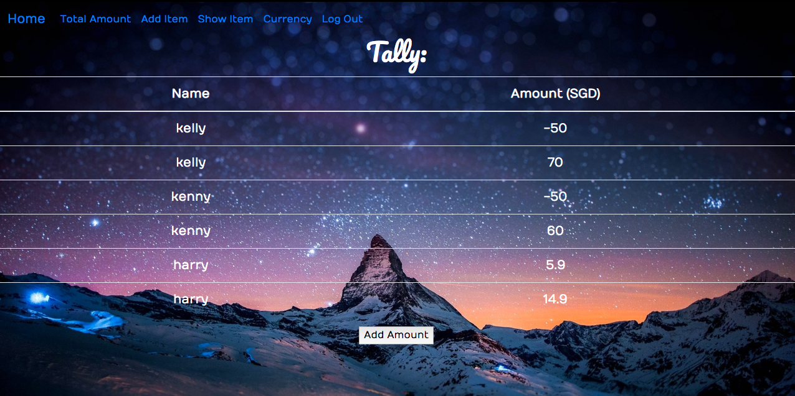
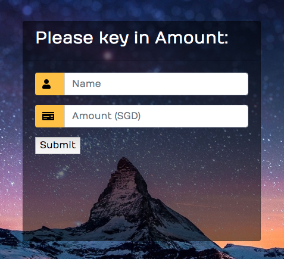

# Tally



This app aims to ease users from the trouble of keeping track of the amount or items that they owe to others. It is otherwise known as an Owing Tracker.


## Technologies Used

* Javascript
* NodeJS
* Express
* React
* PostgreSQL
* Bootstrap 4
* Currency Converter API

## Approach

I started by listing down the needs/goals as well as frustrations and challenges commonly faced by people. That helped me to narrow down the number of tables I need as well as the functionality of it. This also helps to provide me with the details I would include in my navigation bar which would help to show what form is needed to be rendered for each page. 

I have sectioned my codes into different parts, for example; Amounts, Items, Login/Register, Currency API. This would help me to locate and trace back the routes.



## Installation Instructions

1. Install all the depencies of the project
```
npm install
```
2. Create the Postgres db for running on local
```
createdb payup_db -U USERNAME
```
3. Create the tables neccessary to run this project
```
psql -d payup_db -U USERNAME -f tables.sql
```
Use NodeJS and the following dependencies: 
```
    "bootstrap": "^4.3.1",
    "cookie-parser": "^1.4.4",
    "express": "^4.17.1",
    "express-react-views": "^0.11.0",
    "jquery": "^3.4.1",
    "js-sha256": "^0.9.0",
    "jsonfile": "^5.0.0",
    "method-override": "^3.0.0",
    "pg": "^7.12.1",
    "react": "^16.10.2",
    "react-dom": "^16.10.2"
```

## Unsolved Problems

Create a dropdown list for the Currency Converter API so that users can calculate the exchange rate on the same page and have the users do an input by making it dynamic.

## Problem Statement 

"Forgetful people needs a way to keep track of how much they owe so that they do not lose friendships."